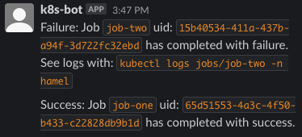

# Kubernetes Native Slackbot with Python

Background: [Jobs](https://kubernetes.io/docs/concepts/workloads/controllers/job/) in Kubernetes are a way to run a batch job or some code until completion.  What if we wanted a Slack bot to notify us about the status of completed Jobs (success or failure) that runs natively on Kubernetes?  We would need to create a daemon that watches Jobs and takes action according to their status. This is also a good way to learn Kubernetes, as it requires gluing a bunch of stuff together. Here is a description of the pieces:

## Setting up permissions

The permissions for our app are defined in the following sections of [controller-permissions.yml](./controller-permissions.yml):

- **`ServiceAccount`**: this is an account that is allowed to access the Kubernetes API.  You usually don't use this when deploying apps on Kubernetes unless you are creating tools for Kubernetes (like we are)
- **`Role`**: this specifies the permissions of the role, which will be a `ServiceAccount` due to the `RoleBinding`
- **`RoleBinding`**: this is a mapping that associates the `Role` with the `ServiceAccount`.
- **`NameSpace`**: you can segment and organize your applications in Kubernetes with a NameSpace, which is a good idea for security purposes.  The namespace is named "hamel" in this example. The `-n` flag to `kubectl` in [run.sh](./run.sh) sets the namespace.

Reading through [Kubernetes concepts](https://kubernetes.io/docs/concepts/) is helpful to get an overview if you are interested.

### Secrets

The Slack bot in this example requires a token; for that, we will use [Kuberentes Secrets](https://kubernetes.io/docs/concepts/configuration/secret/).  Instead of creating a YAML file with the secret, the script [`run.sh`](./run.sh) creates a secret from the environment variable `SLACK_TOKEN`.  The secret is exposed as an environment variable in [controller-deployment.yml](controller-deployment.yml).

## Deploying the Bot

The deployment for the daemon is defined in [controller-deployment.yml](controller-deployment.yml).  Concretely, the `Deployment` will run a pod, which will run your container with your code that watches Kubernetes events for new jobs.  This includes the Docker Container that will run the [Bot's code](#bot-code).


## Bot Code

The code is defined in two places:

- [Dockerfile](./Dockerfile): This is the environment the daemon will run in.  The command at the end runs the python script.
- [py-operatory.py](./py-operator.py): This is the python code that watches for jobs and optionally sends slack messages.

## Job(s) We Want to Monitor

[job.yml](./job.yml) specifies two jobs we want to run: `job-one` and `job-two`.  The first one will be successful, while the second one has an error.


# To Run The Example

## Prerequisites

1. Install [K8s locally with minikube](https://minikube.sigs.k8s.io/docs/start/).  If you are using Docker Desktop, you need to also run this in your terminal: `eval $(minikube docker-env)` and put that in your `.bashrc` file so that Minikube can use the correct Docker daemon.
2. Optionally setup a SlackBot using [these instructions]( https://www.pragnakalp.com/create-slack-bot-using-python-tutorial-with-examples/) and export your secret token to an environment variable: `export SLACK_TOKEN=<your-token>`.  The channel name is hardcoded at the moment, so you need to invite your bot to a channel named `#k8s-notifications`.  You can make this more flexible if you like by following [these steps](#next-steps).

## Running The Example

You can run this bash script which creates all the Kubernetes resources and prints the logs. See the comments in [run.sh](./run.sh) for more context on what this script does.

```bash
./run.sh
```

### Output

You will see that `job-one` succeeds, whereas `job-two` fails:

```bash
% ./run sh
...
naming to docker.io/library/py-operator:v1
namespace/hamel created
serviceaccount/py-operator created
role.rbac.authorization.k8s.io/py-operator created
rolebinding.rbac.authorization.k8s.io/py-operator created
secret/slackbot-token created
deployment.apps/py-operator created
job.batch/job-one created
job.batch/job-two created
Monitoring Jobs...
Failure: Job `job-two` uid: `15b40534-411a-437b-a94f-3d722fc32ebd` has completed with failure.
Success: Job `job-one` uid: `65d51553-4a3c-4f50-b433-c22828db9b1d` has completed with success.
```

Furthermore, if you setup the Slack bot, the output will look like this:



As the slack message suggests, you see the logs with the command `kubectl logs jobs/job-two -n hamel`:

```bash
$ kubectl logs jobs/job-two -n hamel

Found 2 pods, using pod/job-two-slp8k
Traceback (most recent call last):
  File "<string>", line 1, in <module>
Exception: This is an error
```

## Next Steps

Right now, the slack channel and messages are hardcoded in [py-operator.py](./py-operator.py).  You could use [annotations](https://kubernetes.io/docs/concepts/overview/working-with-objects/annotations/) to send parameters for these items to the slackbot with the python Kubernetes client like so:

```python
from kubernetes import client, config, watch

config.load_incluster_config()
job_client = client.BatchV1Api()
namespace = open('/var/run/secrets/kubernetes.io/serviceaccount/namespace').read()

w = watch.Watch()
for event in w.stream(job_client.list_namespaced_job, namespace=namespace):
    obj = event['object']

    # do something with these annotations
    annotations = obj.metadata.annotations
    # ....
```

You would have to edit [py-operator.py](./py-operator.py) to update the python code and [controller-deployment](./controller-deployment.yml) to add the annotations.
